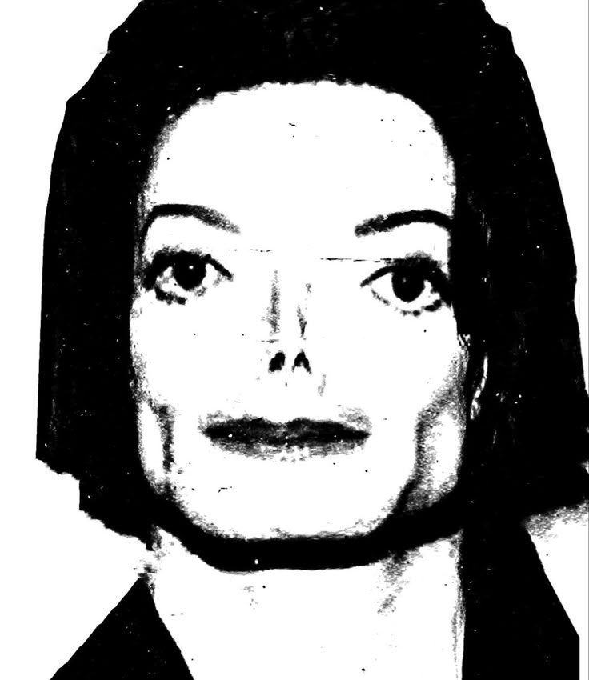

# Introduction

Lors de notre deuxième année de cycle ingénieur (FISE), nous nous sommes investis dans la création de la "MachineThatDraw". L'objectif de ce projet était de concevoir une machine capable de dessiner de manière autonome n'importe quelle image que nous lui transmettons. Pour mettre notre travail à l'épreuve et valider la finesse du tracé, nous avons décidé de relever un défi technique en lui faisant reproduire un portrait de Michael Jackson.

## Contexte du Projet

Cras elementum ultrices diam. Maecenas ligula massa, varius a, semper congue, euismod non, mi. Proin porttitor, orci nec nonummy molestie, enim est eleifend mi, non fermentum diam nisl sit amet erat.

## Objectifs du Projet

L'objectif de ce projet 

# Existant

Praesent blandit adipiscing velit. Suspendisse potenti. Donec mattis, pede vel pharetra blandit, magna ligula faucibus eros, id euismod lacus dolor eget odio.

# Cahier des Charges

Nam dui ligula, fringilla a, euismod sodales, sollicitudin vel, wisi. Morbi auctor lorem non justo. Nam lacus libero, pretium at, lobortis vitae, ultricies et, tellus.
